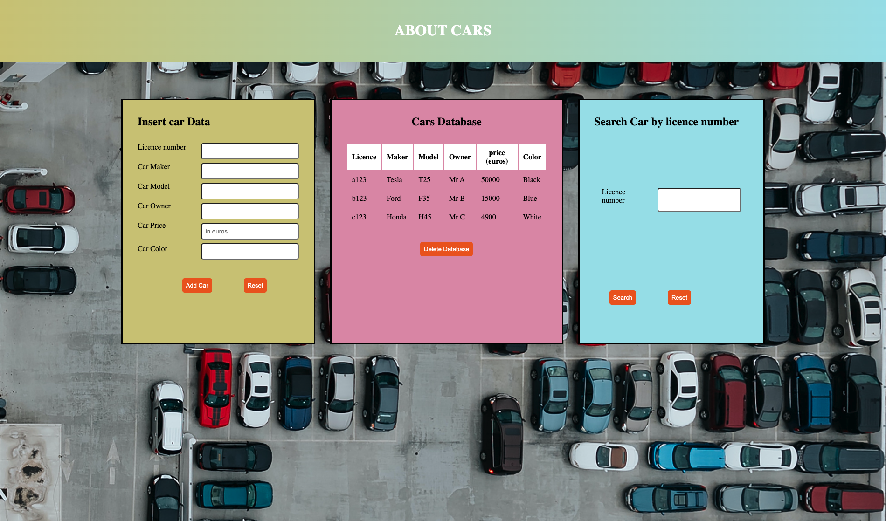

# Project Cars

This project is an assignment for the course JS. 

## DISCRIPTION:

Step 1: 

-Ask for the car’s licence plate, car maker, car model, current owner, price and color. 
-Get the user input and create a new car object based on those properties. Show the data as a table on a webpage. 

Step 2: 

-Create a function that allows the user to search for a specific car based on a license plate. 
-When the licence plate is found, show the car mark, model and owner on the screen.  

Step 3: 

-Create a method discount() for the car object that returns a discounted price. The discounted price depends on the price of the car. If the price is over 20 000, the discount is 25%. If it is under 5000, it is 10%. Otherwise, the discount is 15%. 
-Display the discount % and the discount amount in the search

## Technologies used

Built with: 

- JS
- HTML
- CSS

## Link

Live page [here] https://public.bc.fi/s2300095/shree/Cars/

## Author

Shree Ram Bhusal
- GitHub @shree0007

## Screenshot
